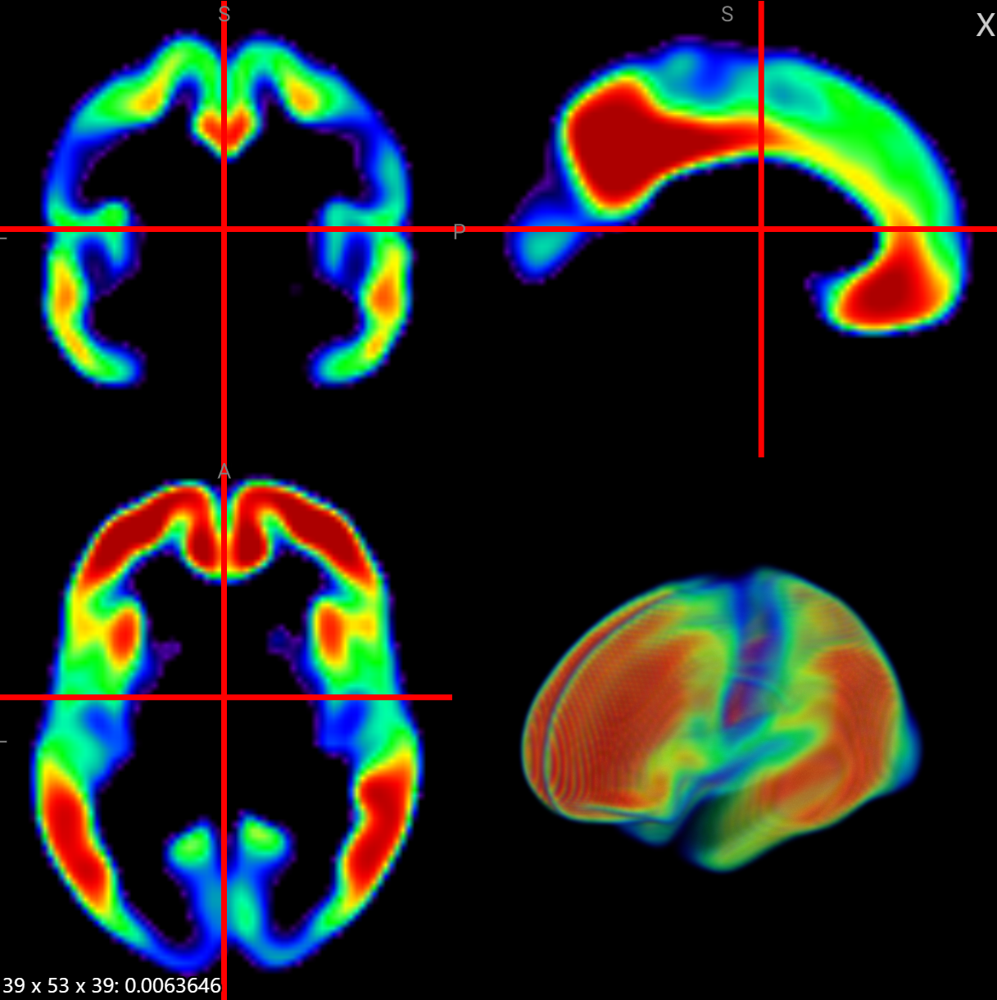
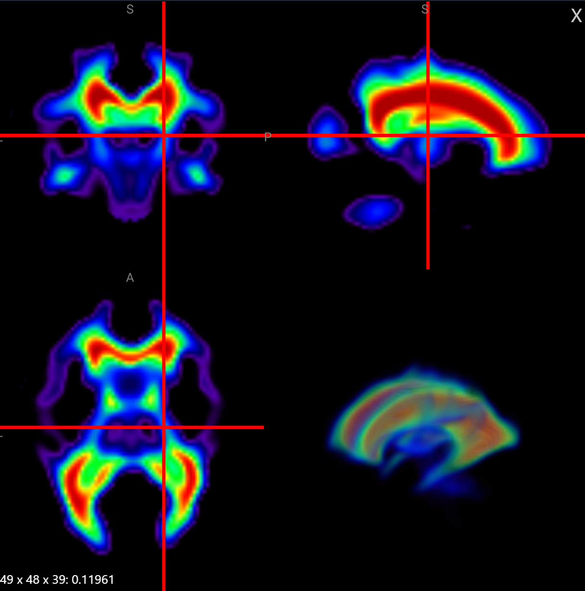
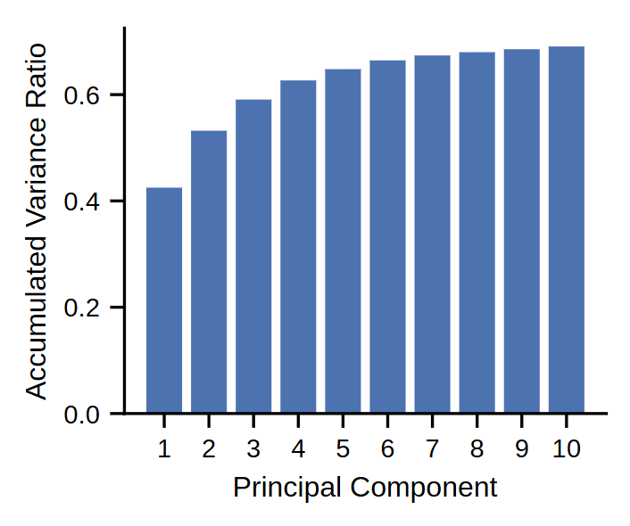
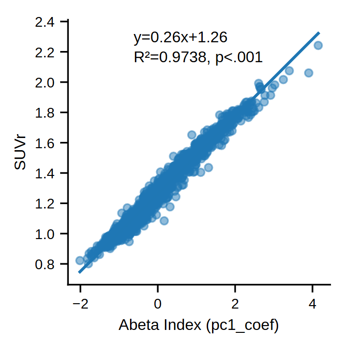
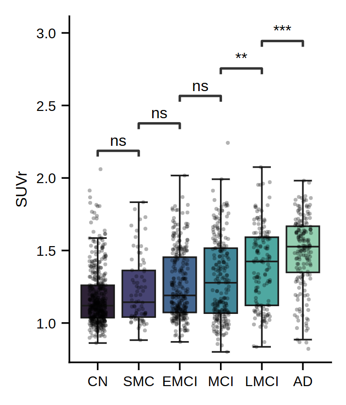
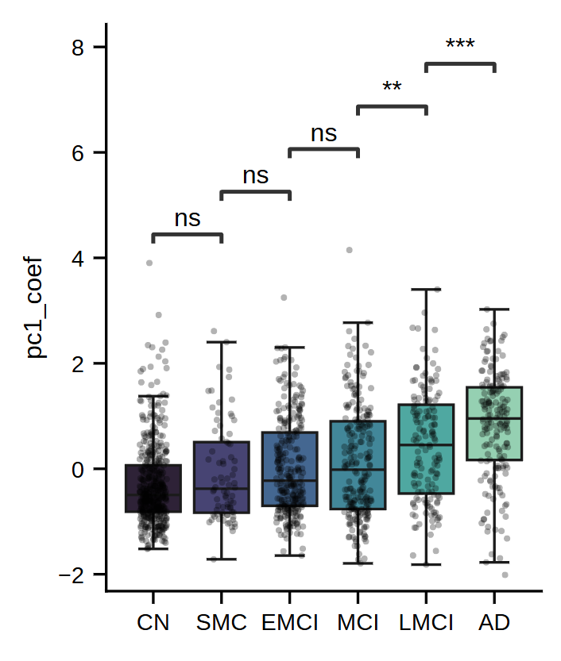

# Reproduction Report for Aβ Index

Lilja *et al.* [1] reported a combined optimization technique aimed at simultaneously performing spatial normalization and semi-quantitative analysis for Alzheimer’s disease (AD). Leuzy *et al.* [2] further validated the equivalence of the Aβ index to SUVr in semi-quantitative analysis across multi-source datasets.

Owing to differences in the technical pipeline, we could not fully reproduce the Aβ index using DCCC. In our approximate reproduction experiments, however, we were able to largely replicate the main findings reported for the Aβ index.

In line with the conclusions of Leuzy *et al.* [2], we did not find any advantage of the Aβ index over SUVr (and likely over Centiloid as well). The PCA-based image decomposition and reconstruction approach, nevertheless, captured AD-related change trends more effectively. That is, the Aβ index does not require pre-specified ROIs or supervised labels; semi-quantitative results highly correlated with SUVr can be obtained through unsupervised learning on a large sample. This property is of interest for the design of future imaging biomarkers.

## Methods and Materials

### Data

The analysis used the full ADNI PET Core dataset with the acquisition strategy “AV45 Coreg, Avg, Std Img and Vox Siz, Uniform Resolution”, comprising 3170 scans from 1374 patients. Nonlinear spatial normalization was performed using DCCC Slicer.

### Reproducibility Differences

The original method of Lilja *et al.* [1] tightly couples the determination of the Aβ index with spatial normalization, obtaining the optimal Aβ index by jointly optimizing the AD-related component and spatial normalization parameters. In the present reproduction, we used the spatial normalization results from DCCC Slicer directly.

This raises an important limitation: we could not compute the Aβ index in strict accordance with the original pipeline. The cost functions reported in the original work (e.g. normalized cross-correlation) were designed for spatial normalization rather than for index estimation.

We therefore introduced the following modifications.

### Reference region

SUVr was computed using the union of regions defined in the Centiloid Project by Klunk *et al.* [3] as the target ROI and the whole cerebellum as the reference region.

### Cost Function

The original implementation of Lilja *et al.* [1] used normalized mutual information for the initial alignment and normalized cross-correlation for the final registration. In our experiments we used a simple L2 loss to directly solve for the scale of the AD-related component (i.e. the Aβ index).

### Principal Component Image Construction

The spatially normalized template in Lilja *et al.* [1] is given by:

$$
I_{\mathrm{PC}_i} = D \boldsymbol{q}_i
$$

where $\boldsymbol{D}^{p \times n}$ is the data matrix ($p$ is the number of voxels, $n$ is the number of images), and $\boldsymbol{q} \in \mathbb{R}^n$ is the right singular vector in sample space (unit vector). This is equivalent to:

$$
I_{\mathrm{PC}_i} = s_i \boldsymbol{v}_i
$$

where $s_i$ is the singular value and $\boldsymbol{v}_i \in \mathbb{R}^p$ is the left singular vector in voxel space. Singular values scale with sample size; in the PCA setting, for explained variance $\lambda_i$ we have:

$$
s_i = \sqrt{(n-1)\lambda_i}
$$

with

$$
\lambda_i = \frac{s_i^2}{n-1}.
$$

The original framework then builds the following template image in conjunction with spatial normalization:

$$
I_{\mathrm{synthesis}} = I_{\mathrm{PC-CN}} + w\, I_{\mathrm{PC-AD}}
$$

where $I_{\mathrm{PC-CN}}$ and $I_{\mathrm{PC-AD}}$ correspond to the two template axes (cognitively normal baseline and AD pathology), and $w \in [-1, 1]$ is the weight (i.e. the Aβ index).

Thus, the $I_{\mathrm{PC}_i}$ from the original formulation are not normalized to the intensity scale of the original SUVr images (or their mean-centred versions). In that framework, $w$ is estimated during registration via similarity measures (NMI/NCC) that are less directly tied to absolute intensity scaling than an L2 reconstruction loss; therefore, the absolute magnitude of the PC images is not explicitly constrained in the original optimization. Here we instead directly estimate the scale of the AD-related component, so we need to bring $I_{\mathrm{PC}_i}$ onto the intensity scale of the original SUVr images. We therefore use the loading-based representation (1-SD scaled PC image):

$$
I_{\mathrm{PC}_i}' = \sqrt{\lambda_i}\,\boldsymbol{v}_i
$$

A further difference from the original work is that Lilja *et al.* [1] do not explicitly describe mean subtraction for new images when constructing $I_{\mathrm{synthesis}}$. In our pipeline we subtract the mean from each new image before decomposition. We thus seek the optimal $w'^*$ such that:

$$
w'^* = \arg\min_{w'} \|\boldsymbol{x} - \boldsymbol{\mu} - I'_{\mathrm{PC-CN}} - w'\, I'_{\mathrm{PC-AD}}\|_2^2
$$

where $\boldsymbol{x}$ is the new image and $\boldsymbol{\mu}$ is the mean vector. This is a one-dimensional least-squares problem with a closed-form solution. We did not constrain $w'$ to $[-1, 1]$; it may fall outside this interval.

## Results

In our experiments, after semantic alignment, PC1 corresponded to the AD component and PC2 to the CN component (opposite assignment to that in the original report [1]).

| PC1 | PC2 |
|-----|-----|
|  |  |

> Display windows: PC1, 0.11–0.28; PC2, 0.027–0.30.

Lilja *et al*. reported that IPC1/IPC2 explained 94.6% of the variance in a 70-scan template cohort, whereas our PCA was estimated on 3170 scans, leading to a substantially more heterogeneous variance structure and lower variance concentration in the first two components. [1].

The reproduced Aβ index remained highly linearly correlated with SUVr.

Discriminative performance across diagnostic groups was consistent with that of SUVr.

| SUVr | Aβ index |
|------|----------|
|  |  |

> Statistical tests: Mann-Whitney U test.

## Discussion

Because of differences in design and implementation, we did not achieve an exact reproduction of the Aβ index. Within our approximate reproduction, our findings align with the original literature: the Aβ index is highly correlated with SUVr and shows similar group-level discrimination.

A limitation of the Aβ index is that it remains more complex than simple SUVr (and its Centiloid derivative), and cross-tracer conversion may pose additional challenges. Its strength lies in the PCA-based decomposition and reconstruction, which can capture AD-related change trends without pre-specified ROIs or supervised labels, yielding semi-quantitative values that correlate well with SUVr through unsupervised learning on a large sample.

## References

[1] Lilja J, Leuzy A, Chiotis K, Savitcheva I, Sörensen J, Nordberg A. Spatial normalization of 18F-flutemetamol PET images using an adaptive principal-component template. *J Nucl Med.* 2019;60(2):285–291.

[2] Leuzy A, Lilja J, Buckley CJ, Ossenkoppele R, Palmqvist S, Battle M, et al. Derivation and utility of an Aβ-PET pathology accumulation index to estimate Aβ load. *Neurology.* 2020;95(21):e2834–e2844.

[3] Klunk WE, Koeppe RA, Price JC, Benzinger TL, Devous Sr MD, Jagust WJ, et al. The Centiloid Project: standardizing quantitative amyloid plaque estimation by PET. *Alzheimers Dement.* 2015;11(1):1–15.e1–4.
