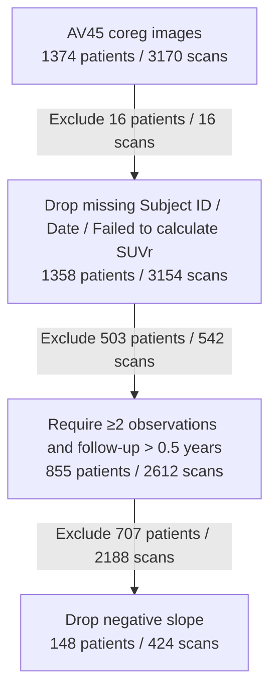
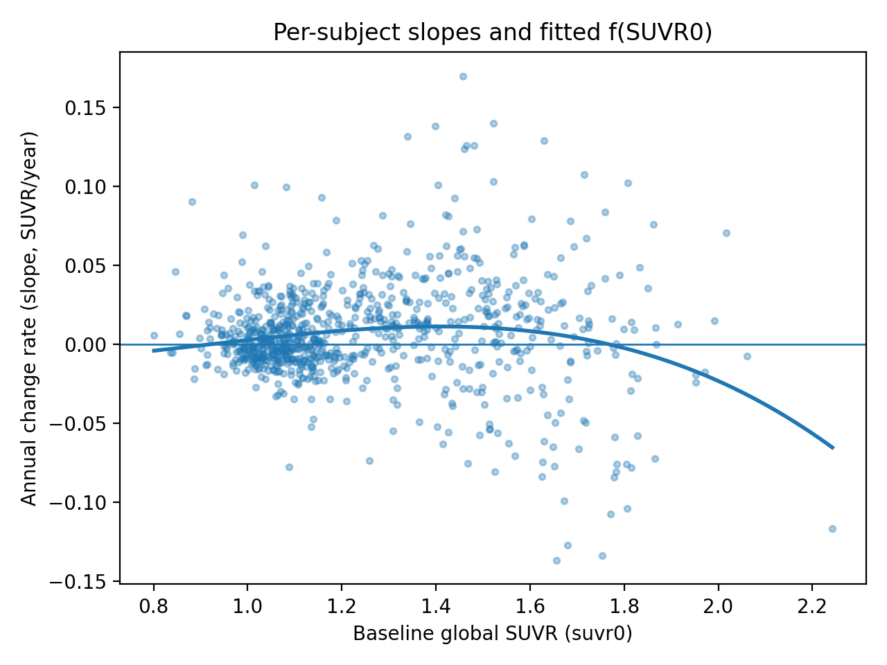
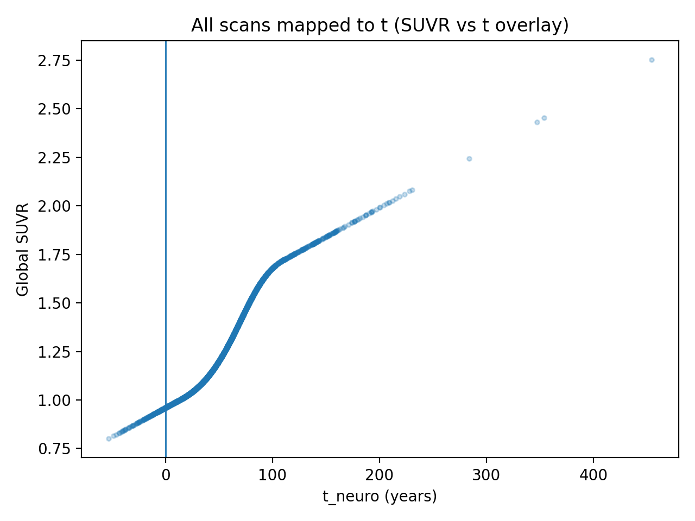
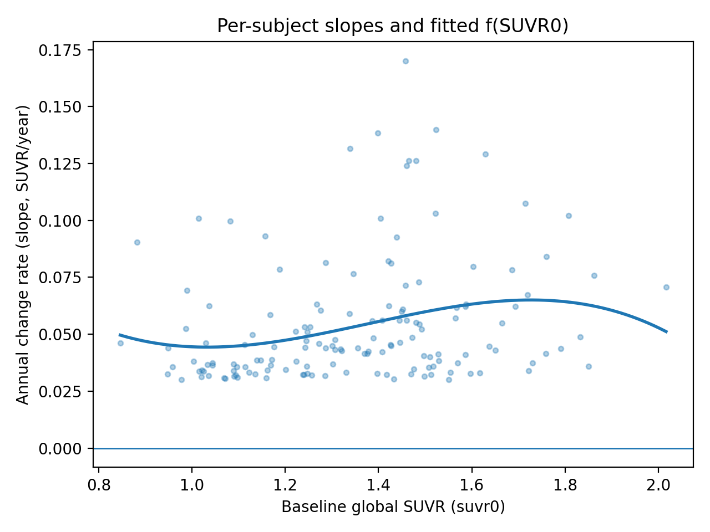
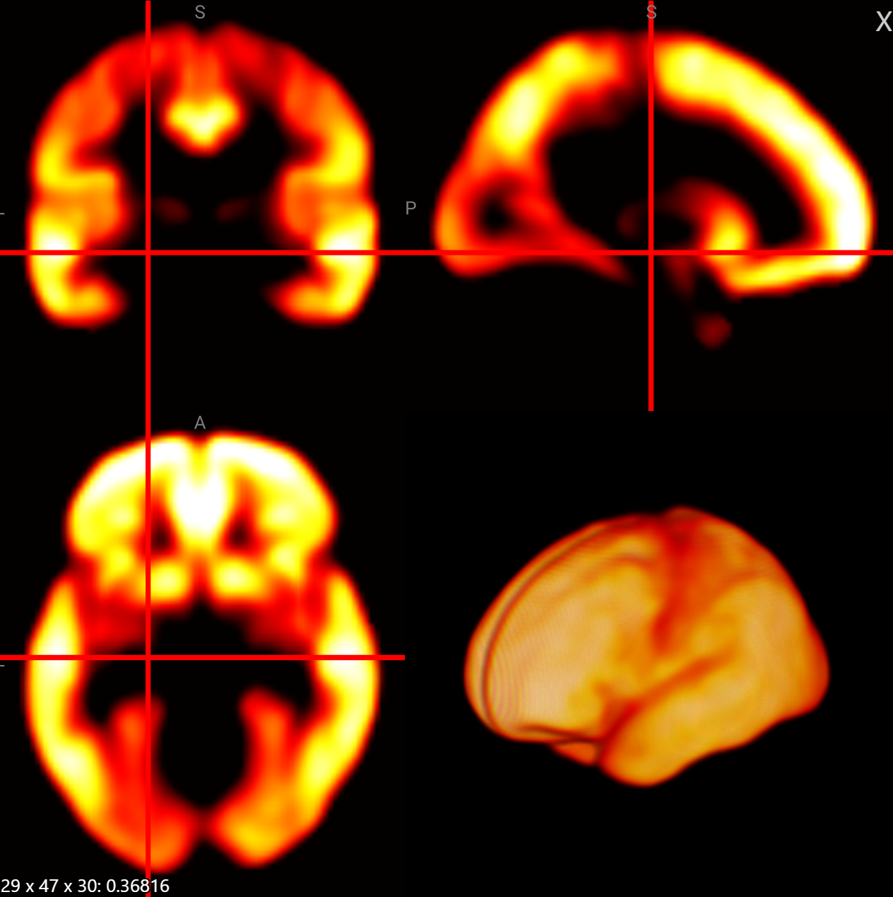
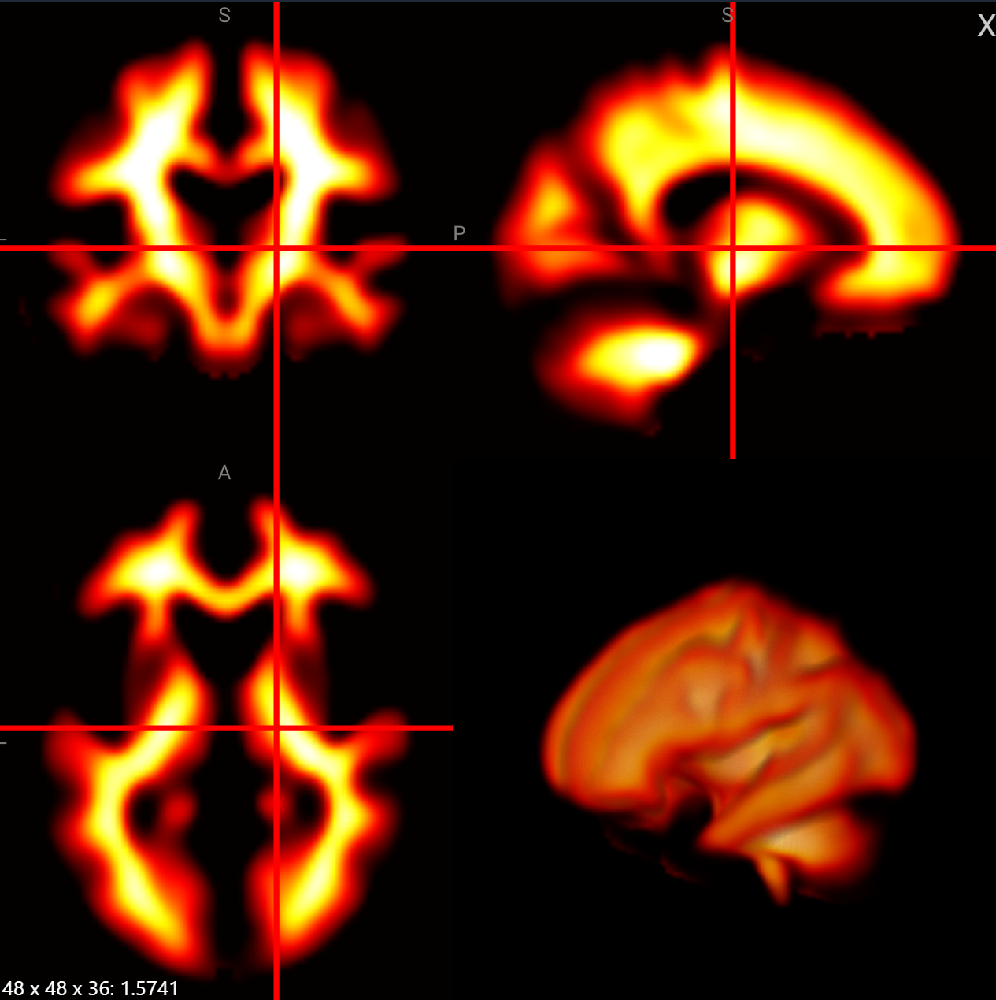
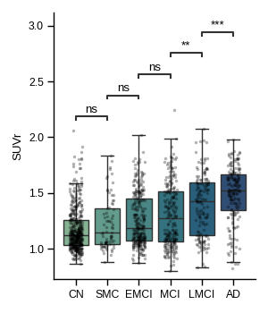
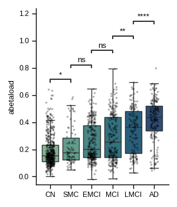

## Reproduction report of the Aβ load metric

This document summarizes our attempt to reproduce the voxel-wise nonspecific binding (NS) and carrying capacity (K) maps reported in Whittington et al. [1], hereafter referred to as the “carrying-capacity” paper. Reproducing the full β-amyloid load (Abeta load, aka AmyloidIQ) model is challenging, mainly because the SUVr distribution and temporal dynamics in our ADNI-based replication cohort differ substantially from those in the upstream datasets used in the original studies, and because the construction of Abeta load relies on several additional approximations and assumptions.

Despite these challenges, by carefully adjusting the composition of the ADNI dataset, we were able to obtain NS and K maps that are qualitatively similar to those in the original publication. Visual inspection of NS and K suggests broad agreement with [1], although some discrepancies remain.

## Data and Methods

We used preprocessed PET images from the ADNI PET Core with the strategy `AV45 Coreg, Avg, Std Img and Vox Siz, Uniform Resolution`. Nonlinear spatial normalization was performed using DCCCSlicer.

### Cohort Selection Flowchart

The following Mermaid flowchart summarizes the selection pipeline and the number of patients/scans removed at each step.

Global cortical SUVr was computed using the Centiloid VOI (combined cortical regions) and whole cerebellum reference region as defined in the Centiloid Project [2]. For regional analyses, we used the AAL parcellation to extract SUVr values in each region, which were subsequently used for modeling. Further methodological details follow the procedures described in Whittington et al. [1].

## Reproduction Notes

Jack et al. [3] describe a characteristic pattern for β-amyloid deposition: the accumulation rate initially accelerates with increasing baseline SUVr and then decelerates as the system approaches a plateau. We attempted to recover this relationship in ADNI by plotting the annual SUVr change against baseline SUVr for AV45 using the Centiloid ROI/reference definition. The resulting relationship is shown below:

However, this result is highly noisy. In particular, a subset of subjects in the intermediate SUVr range exhibit apparently spurious decreases in SUVr, which lower the estimated annual change. As a consequence, the inferred duration of the β-amyloid accumulation phase substantially exceeds that reported in the original work.

According to the rate curves in [3], the annual cortical SUVr change is expected to be approximately 0.1 SUVr/year for PiB. Even after applying the linear PiB-AV45 conversion formulas reported in Landau et al. [4] and Whittington et al. [1], the corresponding AV45 cortical SUVr rate should still be on the order of 0.05 SUVr/year. In contrast, our ADNI-based estimates are much lower, with peak values of only about 0.01 SUVr/year.

> Key assumption in the Abeta load model: the rate curves reported in Jack et al. [3] are taken as reliable upstream constraints. Our experiments suggest that this assumption is highly sensitive to the exact construction of the underlying dataset.

Given these discrepancies, we conclude that reproducing the original rate curves and derived Abeta load values directly from the preset ADNI cohort used here is not realistic.

### Dataset Resampling

Although our ADNI replication cohort differs markedly from that of the original studies, both Whittington et al. [1] and Jack et al. [3] report estimates of the key parameters $r$ (growth rate) and $T_{50}$ (time at half-maximum) in the logistic model. We therefore treated these published parameter values as targets and attempted to construct a “cherry-picked” ADNI subset that is more consistent with the logistic trajectory:

$$
\mathrm{SUVr}(t) = \mathrm{NS} + \frac{K}{1 + e^{-r (t - T_{50})}}.
$$

Specifically, we first estimated individual annual SUVr change using linear regression across multiple time points (ordinary least squares). We then imposed a minimum threshold on the annual change (0.03 SUVr/year in this experiment) and discarded subjects whose estimated rate fell below this threshold. The resulting relationship between annual SUVr change and baseline SUVr is shown below:

From this resampled cohort, we obtained the following estimates of $r $ and $T_{50}$:

| Source | r (1/year) | T50 (years) |
| --- | --- | --- |
| Neurology (2013)\* [3] | ~0.25 | ~14.8 |
| JNM (2018) [1] | 0.20 | 14.9 |
| Ours (original ADNI) | 0.06 | 68.4 |
| Ours (cherry-picked ADNI) | 0.15 | 14.0 |

> \*: The Neurology paper does not explicitly report these numerical values; we approximated them from Figure 3 in [3].

Although our estimates do not perfectly match the published values, they are of the same order of magnitude and capture the qualitative behavior of the logistic trajectory.

## NS and K Maps

Following the methodology in Whittington et al. [1], we fitted voxel-wise logistic curves to obtain nonspecific binding (NS) and carrying capacity (K) maps. The resulting parametric images are shown below:

| K | NS |
| -- | -- |
|  |  |

> K window: 0.38-1.90; NS window: 0.72-1.80.

## Comparison with SUVr

| SUVr | Abeta load |
|---|---|
|  |  |

> Statistical test: Mann-Whitney U; performed between each pair of adjacent groups. Data source: Baseline examinations from all ADNI PET core preprocessed image participants.
>
> SUVr: Centiloid SUVr

## References

[1] Whittington A, Sharp DJ, Gunn RN. *Spatiotemporal distribution of β-amyloid in Alzheimer disease is the result of heterogeneous regional carrying capacities*. J Nucl Med. 2020.  
[2] Klunk WE, Koeppe RA, Price JC, Benzinger TL, Devous Sr. MD, Jagust WJ, et al. *The Centiloid Project: Standardizing quantitative amyloid plaque estimation by PET*. Alzheimers Dement. 2015.  
[3] Jack CR, Wiste HJ, Lesnick TG, Weigand SD, Knopman DS, Vemuri P, et al. *Brain β-amyloid load approaches a plateau*. Neurology. 2013.  
[4] Landau SM, Breault C, Joshi AD, Pontecorvo M, Mathis CA, Jagust WJ, et al. *Amyloid-β imaging with Pittsburgh compound B and florbetapir: Comparing radiotracers and quantification methods*. J Nucl Med. 2013.  