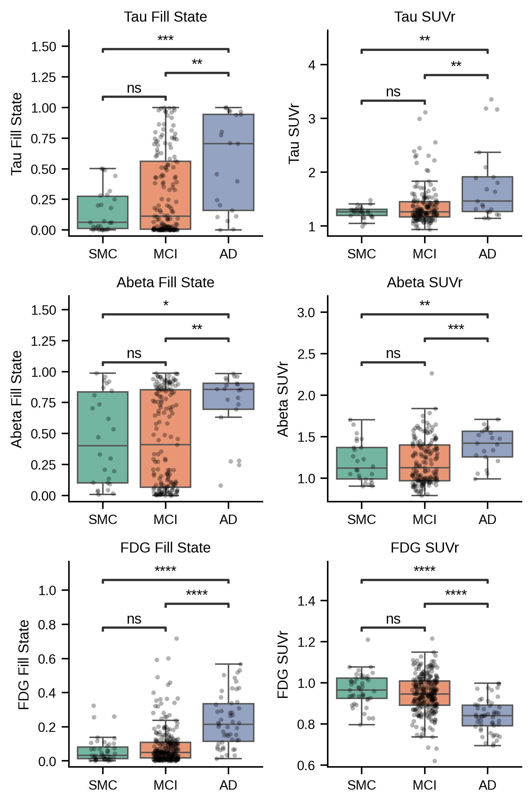

# Reproduction Summary

> Doering E, Hoenig MC, Giehl K, et al. “Fill States”: PET-derived Markers of the Spatial Extent of Alzheimer Disease Pathology. Radiology. 2025;314(3):e241482. doi:10.1148/radiol.241482

This directory contains the results for reproducing the analysis of Fill States in ADNI cohorts.

## Results Summary

### Cohorts

According to the inclusion criteria described in the original publication, we identified two cohorts from the ADNI dataset: ADNI A/T (n = 338) and ADNI N (n = 458). Notably, we utilized preprocessed PET images from the ADNI PET Core (coregistered, averaged, standardized images with consistent voxel size) and did not apply restrictions based on acquisition time windows. The final dataset included preprocessed images acquired between March 1, 2007, and September 30, 2021. 

Readers should note that although our reproduced dataset is also derived from ADNI, it does not exactly match the results reported by the original authors.

### Table 1: Distribution of Biomarkers across Groups

| Tracer   | Metric         | CN            | SMC           | MCI           | AD            |
|:---------|:---------------|:--------------|:--------------|:--------------|:--------------|
| Abeta    | SUVr           | 0.94 ± 0.06   | 1.20 ± 0.24   | 1.19 ± 0.27   | 1.39 ± 0.22   |
| Abeta    | Fill State (%) | 5.36 ± 4.87   | 45.82 ± 36.67 | 45.24 ± 37.52 | 73.46 ± 27.28 |
| Abeta    | Centiloid      | -2.62 ± 10.03 | 47.42 ± 45.94 | 48.13 ± 50.53 | 79.85 ± 38.97 |
| Tau      | SUVr           | 1.18 ± 0.09   | 1.26 ± 0.11   | 1.38 ± 0.36   | 1.77 ± 0.70   |
| Tau      | Fill State (%) | 4.59 ± 9.24   | 15.55 ± 17.58 | 29.25 ± 33.13 | 55.02 ± 38.81 |
| Tau      | Centiloid      | -2.62 ± 10.03 | 47.42 ± 45.94 | 48.13 ± 50.53 | 79.85 ± 38.97 |
| FDG      | SUVr           | 0.98 ± 0.07   | 0.97 ± 0.08   | 0.95 ± 0.09   | 0.84 ± 0.08   |
| FDG      | Fill State (%) | 4.33 ± 5.24   | 6.14 ± 7.25   | 8.71 ± 10.85  | 23.51 ± 15.17 |
| FDG      | Centiloid      | -1.19 ± 8.86  | 43.10 ± 44.16 | 44.91 ± 45.60 | 82.56 ± 43.45 |

### Table 2: Diagnostic Performance Comparison (Bootstrap AUC)

Patients (MCI + AD) vs Controls (CN + SMC), using 1000× bootstrap to compare AUCs.

| Tracer   |   AUC_SUVr |   AUC_Fill_State |   p-value | Significant   |
|:---------|-----------:|-----------------:|----------:|:--------------|
| Tau      |      0.693 |            0.727 |     0.002 | *             |
| Abeta    |      0.779 |            0.778 |     0.764 |               |
| FDG      |      0.646 |            0.672 |     0.046 | *             |

### Key Findings

*   **Tau:** Fill State significantly outperforms SUVr (p = 0.002).
*   **FDG:** Fill State significantly outperforms SUVr (p = 0.046).
*   **Abeta:** Both methods perform similarly.
