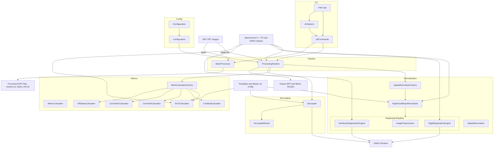

## Developer Guide: Extending the Deep Cascaded Cerebral Calculator

This document is intended for contributors and advanced users who want to extend the **Deep Cascaded Cerebral Calculator** (DCCCSlicer core) with new semi‑quantitative PET biomarkers (\"metrics\"), or understand how the existing ones (Centiloid, CenTauR/CenTauRz, Fill‑states, SUVr) are implemented.

It consolidates and expands the previous “Developer Guide” section from `localizer/src/README.md` and adds a concrete example based on the new `FillStates` metric.

---

## 1. High‑Level Architecture

At a high level, the system is structured as follows:



Key components:

- **Interfaces** (`interfaces/`): contracts for calculators (`IMetricCalculator`), spatial normalizers (`ISpatialNormalizer`), and configuration (`IConfiguration`).
- **Calculators** (`calculators/`): implementations of specific metrics (e.g., `Centiloid`, `CenTauR`, `CenTauRz`, `SUVr`, `FillStates`).
- **Factories** (`factories/`): `MetricCalculatorFactory` and `SpatialNormalizerFactory` manage construction and registration of calculators/normalizers.
- **Pipeline** (`pipeline/`): `ProcessingPipeline` orchestrates I/O, spatial normalization, metric calculation, and decoupling.
- **Decoupling** (`decouplers/`): deep‑learning–based AD‑related pathology extraction.
- **Utilities** (`utils/common.*`): ITK image I/O, resampling, mean computation, path helpers, etc.

---

## 2. Standard Workflow for Adding a New Metric

New metrics in DCCCSlicer typically follow a standard pattern:

1. Define a new `IMetricCalculator` implementation under `localizer/src/calculators/`.
2. Register it in `MetricCalculatorFactory`.
3. Add configuration entries (masks, tracer parameters, etc.) in `assets/configs/config.toml`.
4. Add optional command‑line support (new subcommand) via `cli/Options` and `cli/Commands`.
5. Add tests (unit + CLI/batch integration).

Below is a generic step‑by‑step template you can follow.

### 2.1. Implement the Calculator Interface

Create a new calculator class deriving from `IMetricCalculator`:

```cpp
// localizer/src/calculators/MyNewMetricCalculator.h
#pragma once
#include "../interfaces/IMetricCalculator.h"
#include "../interfaces/IConfiguration.h"

class MyNewMetricCalculator : public IMarkerCalculator {
public:
    explicit MyNewMetricCalculator(ConfigurationPtr config);
    ~MyNewMetricCalculator() override = default;

    MetricResult calculate(ImageType::Pointer spatialNormalizedImage) override;
    std::string getName() const override;
    std::vector<std::string> getSupportedTracers() const override;

private:
    ConfigurationPtr config_;

    struct TracerParams {
        float slope;
        float intercept;
        // Add additional parameters as needed
    };

    std::map<std::string, TracerParams> getTracerParameters() const;
};
```

In the implementation, you typically:

- Load VOI and reference masks via `config_->getMaskPath(...)`.
- Use `SUVrCalculator::calculateSUVr(...)` to compute region‑based SUVr if your metric is derived from SUVr.
- Compute your metric per tracer and populate `MetricResult`.

```cpp
// localizer/src/calculators/MyNewMetricCalculator.cpp
#include "MyNewMetricCalculator.h"
#include "SUVrCalculator.h"
#include "../utils/common.h"

MyNewMetricCalculator::MyNewMetricCalculator(ConfigurationPtr config)
    : config_(config) {}

MetricResult MyNewMetricCalculator::calculate(ImageType::Pointer spatialNormalizedImage) {
    std::string voiMaskPath = config_->getMaskPath("my_metric_voi");
    std::string refMaskPath = config_->getMaskPath("my_metric_ref");

    double suvr = SUVrCalculator::calculateSUVr(spatialNormalizedImage, voiMaskPath, refMaskPath);

    MetricResult result;
    result.metricName = "MyNewMetric";
    result.suvr = suvr;

    auto tracerParams = getTracerParameters();
    for (const auto& [tracerName, params] : tracerParams) {
        float value = suvr * params.slope + params.intercept;
        result.tracerValues[tracerName] = value;
    }

    return result;
}

std::string MyNewMetricCalculator::getName() const {
    return "MyNewMetric";
}

std::vector<std::string> MyNewMetricCalculator::getSupportedTracers() const {
    return {"TRACER1", "TRACER2"};
}

std::map<std::string, MyNewMetricCalculator::TracerParams>
MyNewMetricCalculator::getTracerParameters() const {
    std::map<std::string, TracerParams> params;
    for (const auto& tracer : getSupportedTracers()) {
        std::string key = Common::toLower(tracer);
        TracerParams tp;
        tp.slope     = config_->getFloat("mynewmetric.tracers." + key + ".slope");
        tp.intercept = config_->getFloat("mynewmetric.tracers." + key + ".intercept");
        params[tracer] = tp;
    }
    return params;
}
```

### 2.2. Register the Calculator in `MetricCalculatorFactory`

Add a new enumerator and registration branch:

```cpp
// localizer/src/factories/MetricCalculatorFactory.h
enum class CalculatorType {
    CENTILOID,
    CENTAUR,
    CENTAURZ,
    SUVR,
    FILL_STATES,
    MY_NEW_METRIC,  // <- your new type
};
```

```cpp
// localizer/src/factories/MetricCalculatorFactory.cpp
#include "../calculators/MyNewMetricCalculator.h"

MetricCalculatorPtr MetricCalculatorFactory::create(CalculatorType type, ConfigurationPtr config) {
    switch (type) {
        case CalculatorType::CENTILOID:
            return std::make_shared<CentiloidCalculator>(config);
        case : // other existing types ...
        case CalculatorType::MY_NEW_METRIC:
            return std::make_shared<MyNewMetricCalculator>(config);
        default:
            throw std::invalid_argument("Unknown metric calculator type");
    }
}

MetricCalculatorFactory::CalculatorType
MetricCalculatorFactory::stringToType(const std::string& typeName) {
    std::string lowerName = typeName;
    std::transform(lowerName.begin(), lowerName.end(), lowerName.begin(), ::tolower);

    if (lowerName == "suvr") {
        return CalculatorType::SUVR;
    } else if (lowerName == "centiloid") {
        return CalculatorType::CENTILOID;
    } else if (lowerName == "centaur") {
        return CalculatorType::CENTAUR;
    } else if (lowerName == "centaurz") {
        return CalculatorType::CENTAURZ;
    } else if (lowerName == "fillstates") {
        return CalculatorType::FILL_STATES;
    } else if (lowerName == "mynewmetric") {
        return CalculatorType::MY_NEW_METRIC;
    }

    throw std::invalid_argument("Unsupported metric calculator type: " + typeName);
}

std::vector<std::string> MetricCalculatorFactory::getAvailableTypes() {
    return {"suvr", "centiloid", "centaur", "centaurz", "fillstates", "mynewmetric"};
}
```

### 2.3. Wire into the Processing Pipeline

By default, the `ProcessingPipeline` uses `MetricCalculatorFactory::createSelected(selectedMetric, config_)` to construct the requested metric(s) and then calls `calculate`:

```cpp
// localizer/src/pipeline/ProcessingPipeline.h
struct ProcessingOptions {
    bool   skipRegistration = false;
    bool   useIterativeRigid = false;
    bool   useManualFOV = false;
    bool   enableADNIStyle = false;
    std::string decoupleModality = "";  // "abeta", "tau" or empty
    int    maxIterations = 5;
    float  convergenceThreshold = 2.0f;
    bool   enableDebugOutput = false;
    std::string debugOutputBasePath = "";
    std::string selected output image path
    std::string selectedMetric = "";       // "suvr", "centiloid", "centaur", "centaurz", "fillstates", ...
    std::string selectedMetricTracer = ""; // for tracer-dependent metrics (e.g. fill-states)
};

std::vector<MetricResult> calculateMetrics(
    ImageType::Pointer spatiallyNormalizedImage,
    const ProcessingOptions& options);
```

If your metric is not tracer‑dependent (like Centiloid or CenTauR), you typically do **not** use `selectedMetricTracer`; you just set `options.selectedMetric` in `cli/Commands.cpp` and leave `selectedMetricTracer` empty.

If your metric *is* tracer‑dependent (e.g., Fill‑states), you can use `selectedMetricTracer` inside your calculator wiring to pass the user‑specified tracer choice. For example:

```cpp
// localizer/src/pipeline/ProcessingPipeline.cpp
std::vector<MetricResult> ProcessingPipeline::calculateMetrics(
    ImageType::Pointer spatiallyNormalizedImage,
    const ProcessingOptions& options) {
    std::vector<MetricResult> results;

    auto calculators = MetricCalculatorFactory::createSelected(options.selectedMetric, config_);

    for (auto& calculator : calculators) {
        // Example: inject tracer information for a custom metric
        if (Common::toLower(options.selectedMetric) == "mynewmetric") {
            if (!options.selectedMetricTrayyour_metric = dynamic_ca    my_metric->setTracer(options.selectedMetricTracer);
            }
        }

        MetricResult r = calculator-> calculate(spatialNormalizedImage);
        results.push_back(r);
    }

    return results;
}
```

### 2.4. Update Configuration (`assets/configs/config*.toml`)

Typical configuration entries for a new SUVr‑derived metric:

```toml
[masks]
my_metric_voi = "assets/nii/my_metric_voi.nii"
my_metric_ref = "assets/nii/my_metric_ref.nii"

[mynewmetric.tracers.tracer1]
slope = 1.0
intercept = 0.0

[mynewmetric.tracers.tracer2]
slope = 1.2
intercept = -0.5

[suvr.regions.mynewmetric]
voi_mask = "my_metric_voi"
ref_mask = "my_metric_ref"
```

The existing metrics use similar sections:

- `centiloid.tracers.*` – linear transformation parameters for each amyloid tracer.
- `centaur.tracers.*` – percentile mapping parameters.
- `centaurz.tracers.*` – z‑score transformations.
- `fillstates.tracers.*` – per‑tracer mean/std/ROI paths for z‑score maps.

### 2.5. CLI Integration (Optional)

To expose your metric as a top‑level subcommand (like `centiloid`, `centaur`, `centaurz`, `fillstates`), update `cli/Options` and `cli/Commands`.

1. **Add a subcommand parser in `main.cpp`:**

```cpp
// main.cpp
argparse::ArgumentParser mymetric_cmd("mymetric");
mymetric_cmd.add_description("Calculate MyNewMetric");
addSUVrDerivedMetricArguments(mymetric_cmd); // or a custom addMyMetricArguments(...)

program.add_subparser(mymetric_cmd);

if (program.is_subcommand_used("mymetric")) {
    return executeMyMetricCommand(mymetric_cmd, fullCommand);
}
```

2. **Add a new command options struct (if needed) and execution function in `cli/Commands.*`:**

```cpp
// cli/Commands.h
int executeMyMetricCommand(const argparse::ArgumentParser& parser,
                           const std::string& fullCommand);
```

```cpp
// cli/Commands.cpp
int executeMyMetricCommand(const argparse::ArgumentParser& parser,
                           const std::string& fullCommand) {
    SUVrDerivedMetricOptions options =
        parseSUVrDerivedMetricOptions(parser, "mynewmetric");
    auto config = loadConfigurationWithLogging(options.configPath, options.enableDebugOutput);

    ProcessingOptions procOptions;
    procOptions.skipRegistration = options.skipRegistration;
    procOptions.useIterativeRigid = options.useIterativeRigid;
    procOptions.useManualFOV = options.useManualFOV;
    procOptions.enableDebugOutput = options.enableDebugOutput;
    procOptions.debugOutputBasePath = options.debugOutputBasePath;
    procOptions.selectedMetric = options.metricType; // "mynewmetric"

    // For tracer-dependent metrics, also set procOptions.selectedMetricTracer

    if (options.batchMode) {
        auto processor = [config, procOptions](const std::string& inputPath,
                                               const std::string& outputPath) -> ProcessingResult {
            ProcessingPipeline pipeline(config);
            return pipeline.process(inputPath, outputPath, procOptions);
        };

        std::cout << "Starting " << options.metricType << " batch processing..." << std::endl;
        return BatchProcessor::runBatch(...);
    }

    ProcessingPipeline pipeline(config);
    std::cout << "Starting " << options.metricType << " calculation: " << options.inputPath << std::endl;
    ProcessingResult result = pipeline.process(options.inputPath, options.outputPath, procOptions);

    std::cout << "\n=== " << options.metricType << " Results ===" << std::endl;
    for (const auto& mr : result.metricResults) {
        std::cout << "Metric: " << mr.metricName << std::endl;
        for (const auto& [tracer, value] : mr.tracerValues) {
            std::cout << tracer << ": " << value << std::endl;
        }
        if (options.includeSUVr) {
            std::cout << "SUVr: " << mr.suvr << std::endl;
        }
    }

    std::cout << "Processing completed successfully!" << std::endl;
    return EXIT_SUCCESS;
}
```

If your metric is tracer‑dependent (like `fillstates`), define a dedicated `*CommandOptions` (e.g., `FillStatesCommandOptions`) that adds a `--tracer` argument and maps it into `ProcessingOptions::selectedMetricTracer`.

---

## 3. Example: The `FillStates` Metric

The `FillStates` metric is a concrete example of a **tracer‑dependent, voxelwise z‑score–based** metric, implemented in:

- `localizer/src/calculers/FillStatesCalculator.{h,cpp}`
- `localizer/src/factories/MetricCalculatorFactory.*`
- `localizer/src/pipeline/ProcessingPipeline.*`
- `localizer/src/cli/Options.*`
- `localizer/src/cli/Commands.*`

### 3.1. Concept

`FillStates` quantifies the proportion of voxels within a predefined meta‑ROI that show abnormal signal (e.g., elevated tau or reduced FDG uptake), expressed as a fraction of the ROI’s voxel count:

- **FBP / FTP (amyloid/tau)**: voxels with **z‑score > 1.65** are considered “filled”.
- **FDG (neurodegeneration)**: voxels with **z‑score < −1.65** are considered “filled” (hypometabolism).

The output is:

- `FillStates` metric value per tracer: \( \text{fraction} = \frac{N_{\text{above/below threshold in ROI}}}{N_{\text{voxels in ROI}}} \)
- A binary **fill_states_map** NIfTI image (0/1 mask) aligned to the normalized PET image, written next to the main normalized output as `<output>_fill_states_map.nii`.

### 3.2. Calculator Implementation

The core implementation lives in `FillStatesCalculator`:

- Constructor stores `ConfigurationPtr config_`.
- `setTracer(const std::string& tracer)` sets the active tracer (\"fbp\", \"fdg\", or \"ftp\").
- `calculate(ImageType::Pointer spatialNormalizedImage)`:
  - Validates that `spatialNormalizedImage` is non‑null and that `tracer_` has been set.
  - Uses `IConfiguration` to look up per‑tracer config under `fillstates.tracers.<tracer>`:
    - `fillstates.tracers.<tracer>.mean`
    - `fillstates.tracers.<tracer>.std`
    - `fillstates.tracers.<tracer>.roi`
  - Loads mean, std, and ROI templates with `Common::LoadNii` and resamples them to match the spatially normalized PET (`Common::ResampleToMatch`).
  - Loads the appropriate reference region mask from config:
    - FBP/FDG: `masks.whole_cerebral`
    - FTP: `masks.centaur_ref`
  - Computes the mean value within the reference mask (`Common::CalculateMeanInMask`) and divides the PET by this mean to perform intensity normalization.
  - For each voxel inside the ROI (mask > 0):
    - Computes \( z = \frac{I(x) - \mu(x)}{\sigma(x)} \) (skipping voxels where `σ ≤ 0`).
    - Marks voxels as \"filled\" if `z > 1.65` (FBP/FTP) or `z < −1.65` (FDG).
  - Populates a new `lastMaskImage_` (0/1 float) of the same size/spacing/origin/direction as the normalized PET.
  - Computes the fill fraction and stores it in `MetricResult.tracerValues`, using tracer labels `FBP` / `FDG` / `FTP`. `MetricResult.metricName` is `"FillStates"`, and `suvr` is currently set to `0.0` (reserved for potential future use).

If any required configuration key is missing, or if the reference region mean is non‑positive, the calculator throws a `std::runtime_error` with a descriptive message (for example, *\"Missing fillstates configuration for tracer 'fdg'. Please set fillstates.tracers.fdg.mean/std/roi in config.\"*). These exceptions are propagated up by the pipeline so that the CLI exits with a non‑zero status instead of reporting success.

### 3.3. Factory and Pipeline Wiring

- `MetricCalculatorFactory` has a new `CalculatorType::FILL_STATES` and a corresponding `create` branch:

```startLine:endLine:localizer/src/factories/MetricCalculatorFactory.cpp
MetricCalculatorPtr MetricCalculatorFactory::create(CalculatorType type, ConfigurationPtr config) {
    switch (type) {
        case CalculatorType::CENTILOID:
            return std::make_shared<CentiloidCalculator>(config);
        case CalculatorType::CENTAUR:
            return std::make_shared<CenTauRCalculator>(config);
        case CaseType::CENTAURZ:
            return std::make_shared<CenTauRzCalculator>(config);
        case CaseType::SUVR:
            return std::make_shared<SUVrCalculator>(config);
        case CaseType::FILL_STATES:
            return std::make_shared<FillStatesCalculator>(config);
        default:
            throw std::invalid_argument("Unknown metric calculator type");
    }
}
```

- `MetricCalculatorFactory::stringToType` maps `"fillstates"` to `CalculatorType::FILL_STATES`.
- `ProcessingPipeline::calculateMetrics(...)`:
  - Creates the calculator via `MetricCalculatorFactory::createSelected(options.selectedMetric, config_)`.
  - If `options.selectedMetric == "fillstates"` and `options.selectedMetricTracer` is non‑empty, it calls `fsCalc->setTracer(options.selectedMetricTracer)` before invoking `calculate`.
  - After `calculate` returns, it reads `fsCalc->getLastMaskImage()` into `ProcessingResult.fillStatesMaskImage` and later writes it to `<output>_fill_states_map.nii`.
  - If a `FillStatesCalculator` throws an exception (e.g. due to missing configuration), the pipeline logs the error and rethrows for `fillstates` so that the CLI exits with an error.

### 3.4. CLI and Options for Fill‑states

- `main.cpp` defines a dedicated `fillstates` subcommand:

```startLine:endLine:localizer/src/main.cpp
// Fill-states subcommand
argparse::ArgumentParser fillstates_cmd("fillstates");
fillstates_cmd.add_description("Calculate fill-states metric for PET images");
addFillStatesArguments(fillstates_cmd);
...
program.add_subparser(fillstates_cmd);
...
} else if (program.is_subcommand_used("fillstates")) {
    return executeFillStatesCommand(fillstates_cmd, fullCommand);
}
```

- `cli/Options` defines a `FillStatesCommandOptions` struct and `addFillStatesArguments`, which extends the common SUVr‑derived options with a required `--tracer` argument (`fbp`, `fdg`, `ftp`).
- `cli/Commands::executeFillStatesCommand`:
  - Parses `FillStatesCommandOptions` (including `--tracer`).
  - Populates `ProcessingOptions` with:
    - `selectedMetric = "fillstates"`
    - `selectedMetricTracer = options.tracer`
  - Runs `ProcessingPipeline::process(...)`.
  - Prints the resulting `FillStates` values and (optionally) the underlying SUVr if `--suvr` is set.

### 3.5. Configuration for Fill‑states

The `fillstates` metric is configured via new sections in `assets/configs/config.toml`:

```toml
[fillstates.tracers.fbp]
mean = "assets/nii/fill_states/fs_FBP_mean.nii.gz"
std  = "assets/nii/fill_states/fs_FBP_std.nii.gz"
roi  = "assets/nii/fill_states/fs_FBP_meta_roi.nii"

[fillstates.tracers.fdg]
mean = "assets/nii/fill_states/fs_FDG_mean.nii.gz"
std  = "assets/nii/fill_states/fs_FDG_std.nii.gz"
roi  = "assets/nii/fill_states/fs_FDG_meta_roi.nii"

[fillstates.tracers.ftp]
mean = "assets/nii/fill_states/fs_FTP_mean.nii.gz"
std  = "assets/nii/fill_states/fs_FTP_std.nii.gz"
roi  = "assets/nii/CenTauR.nii"
```

These keys are resolved relative to the executable directory (via `Common::getExecutablePath()`), so they should point to valid NIfTI files installed under `assets/nii/`.

If any of `mean`, `std`, or `roi` is missing for the requested tracer, `FillStatesCalculator::getTracerResources()` throws a `std::runtime_error`, which ultimately causes the CLI command to exit with a non‑zero return code and an error message.

### 3.6. Testing and Examples

The repository includes several tests you can use as references when adding new metrics:

- **Centiloid / CenTauR / CenTauRz CLI tests:**
  - `localizer/src/tests/test_acc_centiloid_centaurz_cli.py`
- **Fill‑states CLI & accuracy tests:**
  - `localizer/src/tests/test_fillstates_cli.py` – basic `fillstates` command behavior and CLI wiring.
  - `localizer/src/tests/test_acc_fill_states_cli.py` – end‑to‑end evaluation of FillStates vs. ground truth (`tests/test_acc_fill_states/gt.csv`).
- **Other utilities:**
  - `tests/calibrate_metrics.py` and `tests/calibrate_tracer/*` – scripts and data for tracer calibration.
  - `tests/test_nii_gz_cli.py` – example of NIfTI I/O and CLI usage.

When implementing a new metric, you can:

1. **Clone** the `FillStates` pattern for tracer‑dependent metrics (if applicable).
2. **Add a dedicated `test_*.py`** for CLI behavior (single‑case sanity check).
3. **Add an accuracy test** under `tests/` with small NIfTI volumes and known ground truth, similar to `test_acc_fill_states_cli.py`.

This approach ensures your new metric is:

- Properly integrated into the factory and pipeline.
- Accessible via a clear CLI interface.
- Covered by automated tests for regression protection.


