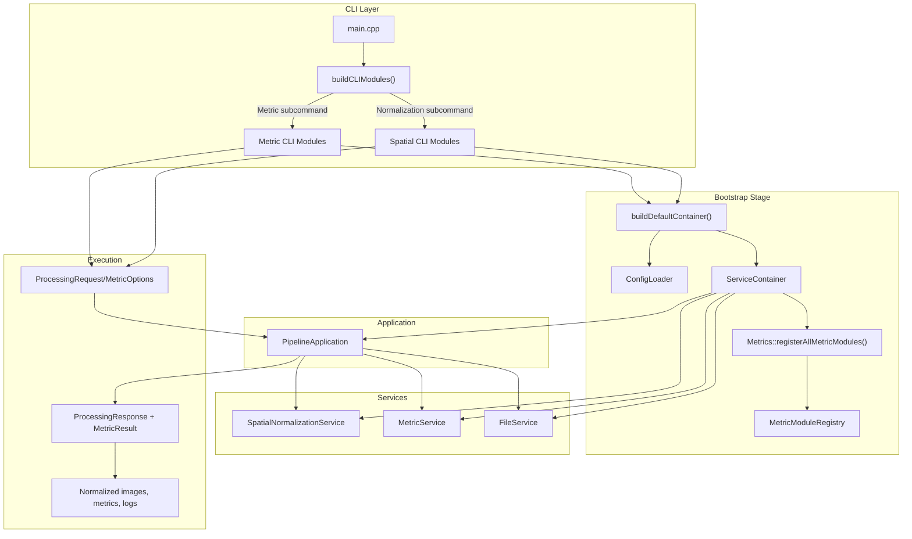

# Developer Guide: Deep Cascaded Cerebral Calculator Core

This guide describes the current `localizer/src` layout, explains how the refactored pipeline wires metrics into the application, and documents the workflow for adding new biomarkers.

## Project Layout (`localizer/src`)

- `assets/` - tracer templates, masks, and default TOML configuration consumed by calculators.
- `core/` - shared runtime infrastructure:
  - `application/` holds `PipelineApplication`, the orchestrator for normalization, metric computation, and persistence.
  - `common/` defines cross-cutting helpers plus `ProcessingContracts.h` (requests/responses shared by CLIs and services).
  - `config/` wraps configuration discovery/loading so both legacy and refactored paths reuse TOML data.
  - `di/` contains the lightweight `ServiceContainer` and `Bootstrap` helpers responsible for dependency injection.
  - `interfaces/` enumerates contracts such as `IMetricCLI`, `IMetricLogic`, `IMetricModuleRegistry`, `ISpatialNormalizationCLI`, and configuration adapters.
  - `services/` implements spatial normalization, metric dispatch, file output, and the runtime metric registry facade.
  - `normalizers/` relocates the VoxelMorph plus rigid registration engines reused by `SpatialNormalizationService`.
  - `preprocessing/` exposes reusable ITK image/mask utilities.
- `metrics/` - self-contained metric plug-ins. Each metric folder (e.g., `suvr`, `centiloid`, `fillstates`, `adad`) bundles its CLI module, metric logic, configuration hooks, and helpers. `metrics/shared/` keeps reusable execution utilities such as `BatchMetricExecutor` and debug-path helpers.
- `spatialNormalizations/` - CLI surface for running normalization-only workflows (`normalize`, `adni-pet-core`) plus support code such as `NullMetric`, which lets spatial-only commands reuse the pipeline without emitting metric results.
- `install/`, `build/`, and `tests/` - Conan/CMake helpers, generated build products, and pytest-based CLI regression suites.

## Runtime Flow


```mermaid
graph TD
    subgraph CLI Layer
        Main[main.cpp] --> BuildParsers["buildCLIModules()"]
        BuildParsers -->|Metric subcommand| MetricCLI[Metric CLI Modules]
        BuildParsers -->|Normalization subcommand| SpatialCLI[Spatial CLI Modules]
    end

    subgraph Bootstrap Stage
        MetricCLI --> BootstrapNode["buildDefaultContainer()"]
        SpatialCLI --> BootstrapNode
        BootstrapNode --> ConfigLoader[ConfigLoader]
        BootstrapNode --> Container[ServiceContainer]
        Container --> RegisterMetrics["Metrics::registerAllMetricModules()"]
        RegisterMetrics --> MetricRegistry[MetricModuleRegistry]
    end

    subgraph Services
        Container --> SpatialSvc[SpatialNormalizationService]
        Container --> MetricSvc[MetricService]
        Container --> FileSvc[FileService]
    end

    subgraph Application
        Container --> PipelineApp[PipelineApplication]
        PipelineApp --> SpatialSvc
        PipelineApp --> MetricSvc
        PipelineApp --> FileSvc
    end

    subgraph Execution
        MetricCLI --> Requests[ProcessingRequest/MetricOptions]
        SpatialCLI --> Requests
        Requests --> PipelineApp
        PipelineApp --> Responses[ProcessingResponse + MetricResult]
        Responses --> Output[Normalized images, metrics, logs]
    end
```

### 1. CLI discovery
`main.cpp` builds the executable's command surface at runtime. It iterates over `Pipeline::Metrics::buildCLIModules()` and `Pipeline::SpatialNormalization::buildCLIModules()`, creating an `argparse::ArgumentParser` per module and delegating execution back to the module that owns the selected subcommand.

### 2. Container bootstrap and service graph
Each CLI configures `BootstrapOptions` and calls `Pipeline::buildDefaultContainer(...)`:
1. `ConfigLoader` finds and parses the TOML configuration once.
2. The `ServiceContainer` lazily registers singletons for `IConfiguration`, `ISpatialNormalizationService`, `IMetricModuleRegistry`, `IMetricService`, `IFileService`, and `PipelineApplication`.
3. `Metrics::registerAllMetricModules(container)` immediately populates the metric registry so later requests can resolve by name.

### 3. Metric registration and dispatch
- Every metric exposes `registerMetric(ServiceContainer&)`, which resolves the shared `IMetricModuleRegistry` and registers an `IMetricLogic` implementation under a normalized name (for example, `Centiloid::registerMetric` registers `CentiloidLogic`).
- `MetricModuleRegistry` enforces uniqueness, stores the `IMetricLogic` instances, and resolves them on demand via `run(metricName, request)`.
- `MetricService` bridges application code and the registry: `PipelineApplication` hands it a `MetricComputationRequest`, and the service simply lowercases the metric name, looks it up in the registry, and returns whatever the logic calculated.

### 4. Application execution
`PipelineApplication::run` is invoked for both single-file and batch flows:
1. `ISpatialNormalizationService::normalize` loads the PET volume, applies optional rigid plus voxel-morph registration, and returns the `SpatialNormalizationResponse` (rigid/aligned images plus metadata).
2. If `ProcessingRequest::persistNormalizedImage` is true, `IFileService` saves the normalized NIfTI alongside any auxiliary maps (for example, FillStates masks).
3. When `ProcessingRequest::computeMetrics` is set, the previously registered metric logic receives the `MetricComputationRequest`, performs calculator-specific work, and returns `MetricResult` records (SUVr, tracer conversions, custom masks, etc.).
4. CLI modules format those results for stdout or CSV (batch mode) and may emit additional files (for example, FillStates saves `<output>_fill_states_map.nii`).

### 5. Batch processing
Most metric CLIs share `metrics/shared/BatchMetricExecutor.*`. A module supplies a `MetricExecutionHooks` struct that:
- Builds a `ProcessingRequest` per input (including CLI-specific metric parameters).
- Resolves debug output paths consistently across single and batch flows.
- Logs per-case success/failure and appends metric results to `results.csv` and `batch_info.txt` via `core/common/BatchLogging`.
`PipelineApplication::runBatch` then loops through `BatchProcessingRequest.items`, invoking user-provided success/error callbacks.

### 6. Spatial-only commands
`spatialNormalizations/standard/NormalizeCLI` and `adni/AdniPetCoreCLI` reuse the exact same services. They register `NullMetric` (name `__spatial_normalization_null`) so that the pipeline can execute with `computeMetrics=true` but without any calculator output, ensuring normalization-only workflows still benefit from shared logging and file persistence.

## Adding a New Metric

1. **Create a metric module folder** under `metrics/<name>/` and add two core files:
   - `<Name>CLI.{h,cpp}` implementing `IMetricCLI`. The CLI is responsible for:
     - Declaring the subcommand name and description.
     - Configuring relevant arguments (input, output, config, debug, tracer switches, VOI/reference masks, etc.).
     - Translating parsed flags into an options struct that `runCommand` can consume.
   - `<Name>Logic.{h,cpp}` implementing `IMetricLogic`. The logic receives the normalized image plus any options encoded in `MetricComputationOptions` (string, bool, or numeric parameters) and returns `std::vector<MetricResult>` entries. Reuse helpers such as `SUVrCalculator`, `FillStatesCalculator`, or new calculators as needed. Throw `std::runtime_error` with descriptive messages for invalid inputs to ensure CLI failures are explicit.

2. **Define CLI execution helpers**. Follow existing modules by:
   - Creating an options struct (e.g., `CentiloidCLIOptions`).
   - Reusing `MetricExecutionHooks` and `Shared::runSingleMetric` / `Shared::runBatchMetric` to encapsulate processing, logging, and debug output handling.
   - Building each `ProcessingRequest` with `computeMetrics=true`, `metricOptions.metricName = "<name>"`, and any metric-specific parameters stored in `metricOptions.stringParameters`, `boolParameters`, or `numericParameters`.

3. **Register the metric** inside your module's `registerMetric(ServiceContainer&)` function:
   - Resolve `IMetricModuleRegistry` and `IConfiguration` via the container.
   - Instantiate your `IMetricLogic` (injecting configuration or other services as needed) and call `registry->registerModule(...)`.
   - Guard against double-registration so repeated CLI invocations remain idempotent.

4. **Expose the CLI to the binary** by updating `metrics/ModuleCatalog.cpp`:
   - Append `modules.push_back(<Namespace>::createCLI())` in `buildCLIModules()` so `main.cpp` discovers your subcommand.
   - Call `<Namespace>::registerMetric(container)` inside `registerAllMetricModules()` so the metric is registered during bootstrap.

5. **Extend configuration and assets** as required. For SUVr-derived metrics, add `[masks]` entries for VOI/reference regions plus tracer sections under `[metric_name.tracers.<tracer>]`. For data-driven metrics (FillStates, ADAD), add paths for template maps, slopes/intercepts, model URIs, etc.

6. **Add regression coverage**. Mirror the structure under `localizer/src/tests/` by:
   - Adding a CLI smoke test (e.g., `test_my_metric_cli.py`) that exercises single-file execution with synthetic data.
   - Including accuracy tests that compare computed values with known reference CSVs where feasible.

7. **Document user-facing behavior** by updating `localizer/src/README.md` with the new subcommand, flags, and practical examples.

## Commands and Typical Usage

All commands are dispatched through the dynamically registered CLIs. Common workflows:

### Centiloid (amyloid burden)
```bash
./DCCCcore centiloid --input amyloid_pet.nii --output result.nii
./DCCCcore centiloid --input amyloid_pet.nii --output result.nii --config custom_config.toml --suvr
./DCCCcore centiloid --input input_dir --output output_dir --batch
```

### CenTauR / CenTauRz (tau burden)
```bash
./DCCCcore centaur --input tau_pet.nii --output result.nii
./DCCCcore centaurz --input tau_pet.nii --output result.nii --suvr
```

### Fill-states (tracer-specific abnormal voxel fractions)
```bash
./DCCCcore fillstates --input amyloid_pet.nii --output result.nii --tracer fbp
./DCCCcore fillstates --input ftp_pet.nii --output result.nii --tracer ftp --suvr
```
This command additionally writes `<output>_fill_states_map.nii` containing the binary suprathreshold mask.

### Custom SUVr and ADAD
```bash
./DCCCcore suvr --input pet.nii --output normalized.nii --voi-mask target_region.nii --ref-mask reference_region.nii
./DCCCcore adad --input pet.nii --output result.nii --modality tau --iterative
```

### Spatial normalization only
```bash
./DCCCcore normalize --input pet.nii --output normalized.nii
./DCCCcore adni-pet-core --input pet.nii --output normalized.nii --iterative
```
All commands accept `--batch`, `--skip-normalization`, `--iterative`, `--manual-fov`, and `--debug` where applicable, matching the options described in `localizer/src/README.md`.

## Current Limitations and Next Steps

- Batch mode currently exists for `centiloid`, `centaur`, `centaurz`, `suvr`, and `adad`. Other CLIs emit explicit errors when `--batch` is supplied so downstream tooling can react.
- Only the rigid VoxelMorph normalizer is wired into `SpatialNormalizationService`; supporting alternative engines requires extending that service to construct different implementations.
- Error handling favors descriptive exceptions and console logs but does not yet emit structured status codes for downstream automation.
- The service container is built per CLI invocation. Long-lived or interactive scenarios would need scoped lifetimes or a reused container instance.

Armed with this structure, you can confidently navigate the refactored pipeline, register new biomarker modules, and understand how the CLI drives normalization plus metric computation end-to-end.
