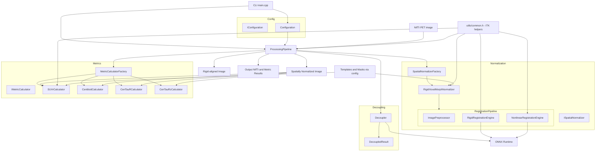

# Deep Cascaded Cerebral Calculator Core

A deep learning-based multimodal brain PET image standardization and semi-quantitative analysis software for neuroimaging biomarker calculation.

## Overview

The Deep Cascaded Cerebral Calculator Core is a comprehensive C++ toolkit designed for automated quantitative analysis of brain PET images. It provides standardized spatial normalization and calculates various semi-quantitative metrics including Centiloid, CenTauR, CenTauRz, and custom SUVr values. The software employs deep learning models for accurate spatial registration and supports multiple PET tracers for both amyloid and tau imaging.

### Key Features

- **Multi-biomarker Support**: Calculates Centiloid (amyloid), CenTauR/CenTauRz (tau), and custom SUVr metrics
- **Deep Learning Pipeline**: Utilizes ONNX-based neural networks for spatial normalization
- **Modular Architecture**: Extensible design with clean interfaces for adding new biomarkers
- **Multi-tracer Compatibility**: Supports various PET tracers with tracer-specific calibrations
- **Decoupling Analysis**: Advanced pathology-specific signal extraction
- **Configuration-driven**: Flexible TOML-based configuration system

## Installation and Build

⚠️ **Important**: This project has complex build requirements and is primarily designed for experienced developers familiar with C++ medical imaging toolchains.

### Prerequisites

- **CMake 3.8+** 
- **Visual Studio 2019/2022** (Windows) or compatible C++17 compiler
- **ITK (Insight Toolkit)** - Medical image processing library
- **SimpleITK** - Simplified ITK Python/C++ interface
- **ONNX Runtime 1.18.0** - Deep learning inference engine
- **argparse 3.1** - Command line argument parsing
- **tomlplusplus 3.4.0** - TOML configuration file parsing

### Build Configuration

The project contains **hardcoded paths** in `CMakeLists.txt` that must be adjusted for your environment:

```cmake
# These paths need to be modified in CMakeLists.txt:
set(ONNXRUNTIME_DIR "E:/projects/sitk/SITKExample/onnxruntime-win-x64-1.18.0")
set(ARGPARSE_INCLUDE_DIR "E:/projects/sitk/SITKExample/argparse-3.1/include")
set(TOMLPP_INCLUDE_DIR "E:/projects/sitk/SITKExample/tomlplusplus-3.4.0/include")
```

### Windows Build Instructions

#### Option 1: PowerShell Build Script (Recommended)

The `install.ps1` script handles compilation and creates a portable distribution:

```powershell
# Edit install.ps1 to match your environment:
# - Update library paths (ITK_DIR, SimpleITK_DIR, etc.)
# - Modify source/build/install directories
# - Adjust VC++ and UCRT redist paths

.\install.ps1 -Config RelWithDebInfo
```


### Creating Portable Applications

If you wish to create a portable version of DCCCcore, be sure to include:

- **UCRT Libraries**: Universal C Runtime from Windows SDK
- **VC++ Redistributables**: Visual C++ runtime libraries (VC143/VC142)
- **ONNX Runtime DLLs**: Required for deep learning inference

The install step copies all necessary DLLs to create a portable application that runs without requiring users to install Visual C++ redistributables.

### Linux Build Notes

While the core codebase is cross-platform, the current CMake configuration is Windows-specific. Linux users will need to:

1. Remove Windows-specific runtime packaging code
2. Install ITK, ONNX Runtime, and other dependencies via package manager
3. Modify library paths in CMakeLists.txt

### 🚀 Help Wanted: CMake Improvements

**We're looking for contributors to help modernize our build system!**

The current CMake configuration has several limitations that make it difficult for new users to build the project:

**Current Issues:**
- Hardcoded absolute paths in `CMakeLists.txt`
- Windows-specific configuration
- Manual dependency path management
- No cross-platform support

**Desired Improvements:**
- [ ] **Cross-platform CMake configuration** that works on Windows, Linux, and macOS
- [ ] **Dependency management** using vcpkg, Conan, or CMake's FetchContent
- [ ] **Find modules** for automatic library detection (FindITK, FindONNXRuntime, etc.)
- [ ] **Configurable build options** for different deployment scenarios
- [ ] **CI/CD integration** with GitHub Actions for automated builds
- [ ] **Package generation** (DEB, RPM, MSI installers)

**Skills Needed:**
- CMake expertise (3.15+ features)
- Cross-platform C++ development experience
- Knowledge of medical imaging libraries (ITK/SimpleITK)
- Package management systems (vcpkg/Conan)

If you're interested in contributing to this improvement, please open an issue or submit a pull request. This would be a significant contribution that would make the project much more accessible to the research community.

## Usage

The software provides a command-line interface with multiple subcommands for different analysis tasks.

### Basic Commands

#### Centiloid Analysis
Calculate standardized amyloid burden scores:

```bash
# Basic Centiloid calculation
./CentiloidCalculator centiloid --input amyloid_pet.nii --output result.nii

# With configuration file
./CentiloidCalculator centiloid --input amyloid_pet.nii --output result.nii --config custom_config.toml

# Include SUVr values in output
./CentiloidCalculator centiloid --input amyloid_pet.nii --output result.nii --suvr

# Skip spatial normalization (pre-normalized images)
./CentiloidCalculator centiloid --input normalized_pet.nii --output result.nii --skip-normalization
```

#### CenTauR Analysis
Calculate standardized tau burden scores:

```bash
# CenTauR percentile scale
./CentiloidCalculator centaur --input tau_pet.nii --output result.nii

# CenTauRz z-score scale
./CentiloidCalculator centaurz --input tau_pet.nii --output result.nii
```

#### Custom SUVr Calculation
Calculate SUVr with user-defined regions:

```bash
./CentiloidCalculator suvr --input pet.nii --output result.nii \
  --voi-mask target_region.nii --ref-mask reference_region.nii
```

#### Spatial Normalization Only
Perform spatial standardization without metric calculation:

```bash
# Standard normalization
./CentiloidCalculator normalize --input pet.nii --output normalized.nii

# ADNI-style processing
./CentiloidCalculator normalize --input pet.nii --output normalized.nii --ADNI-PET-core

# Iterative rigid registration
./CentiloidCalculator normalize --input pet.nii --output normalized.nii --iterative
```

#### Decoupling Analysis
Extract pathology-specific signals:

```bash
# Amyloid decoupling
./CentiloidCalculator decouple --input pet.nii --output decoupled.nii --modality abeta

# Tau decoupling
./CentiloidCalculator decouple --input pet.nii --output decoupled.nii --modality tau
```

### Command Options

| Option | Description |
|--------|-------------|
| `--config <file>` | Configuration file path (default: config.toml) |
| `--debug` | Enable debug mode with intermediate outputs |
| `--iterative` | Use iterative rigid transformation |
| `--manual-fov` | Enable manual field-of-view placement |
| `--skip-normalization` | Skip spatial normalization step |
| `--suvr` | Include SUVr values in metric outputs |

## Configuration

The software uses TOML configuration files to manage paths, parameters, and tracer calibrations. Two default configurations are provided:

- `assets/configs/config.toml` - Deep learning accelerated SPM style spatial normalization.
- `assets/configs/config.fast_and_acc.toml` - Fast and Accurate Amyloid Brain PET Quantification  Without MRI Using Deep Neural Networks by Seung Kwan Kang et al.

### Configuration Structure

#### Model Paths
```toml
[models]
rigid = "assets/models/registration/rigid.onnx"
affine_voxelmorph = "assets/models/registration/affine_voxelmorph.onnx"
abeta_decoupler = "assets/models/decouple/abeta.onnx"
tau_decoupler = "assets/models/decouple/tau.onnx"
```

#### Template and Mask Paths
```toml
[templates]
adni_pet_core = "assets/nii/ADNI_empty.nii"
padded = "assets/nii/paddedTemplate.nii"

[masks]
cerebral_gray = "assets/nii/voi_CerebGry_2mm.nii"
centiloid_voi = "assets/nii/voi_ctx_2mm.nii"
whole_cerebral = "assets/nii/voi_WhlCbl_2mm.nii"
centaur_voi = "assets/nii/CenTauR.nii"
centaur_ref = "assets/nii/voi_CerebGry_tau_2mm.nii"
```

#### Processing Parameters
```toml
[processing]
max_iter = 5
ac_diff_threshold = 2.0
temp_dir = "./tmp"

[processing.crop_mni]
start_x = 8
start_y = 16
start_z = 8
size_x = 79
size_y = 95
size_z = 79
```

#### Tracer Calibrations
```toml
# Centiloid parameters (linear transformation)
[centiloid.tracers.pib]
slope = 93.7
intercept = -94.6

[centiloid.tracers.fbp]
slope = 175.4
intercept = -182.3

# CenTauR parameters (percentile scale)
[centaur.tracers.ftp]
baseline = 1.06
max = 2.13

# CenTauRz parameters (z-score transformation)
[centaurz.tracers.ftp]
slope = 13.63
intercept = -15.85
```

## Developer Guide

### Adding a New Biomarker

To implement a new semi-quantitative biomarker, follow these steps:

#### 1. Implement the Calculator Interface

Create a new calculator class that inherits from `IMetricCalculator`:

```cpp
// NewBiomarkerCalculator.h
#pragma once
#include "../interfaces/IMetricCalculator.h"
#include "../interfaces/IConfiguration.h"

class NewBiomarkerCalculator : public IMetricCalculator {
public:
    explicit NewBiomarkerCalculator(ConfigurationPtr config);
    virtual ~NewBiomarkerCalculator() = default;
    
    MetricResult calculate(ImageType::Pointer spatialNormalizedImage) override;
    std::string getName() const override;
    std::vector<std::string> getSupportedTracers() const override;
    
private:
    ConfigurationPtr config_;
    
    // Define your specific parameter structure
    struct TracerParams {
        float slope;
        float intercept;
        // Add other tracer-specific parameters
    };
    
    std::map<std::string, TracerParams> getTracerParameters() const;
};
```

#### 2. Implement the Calculator Logic

```cpp
// NewBiomarkerCalculator.cpp
#include "NewBiomarkerCalculator.h"
#include "SUVrCalculator.h"
#include "../utils/common.h"

NewBiomarkerCalculator::NewBiomarkerCalculator(ConfigurationPtr config) 
    : config_(config) {}

MetricResult NewBiomarkerCalculator::calculate(ImageType::Pointer spatialNormalizedImage) {
    // 1. Get VOI and reference masks from configuration
    std::string voiMaskPath = config_->getMaskPath("your_voi_mask");
    std::string refMaskPath = config_->getMaskPath("your_ref_mask");
    
    // 2. Calculate SUVr using utility method
    double suvr = SUVrCalculator::calculateSUVr(spatialNormalizedImage, voiMaskPath, refMaskPath);
    
    // 3. Create result structure
    MetricResult result;
    result.metricName = "YourBiomarker";
    result.suvr = suvr;
    
    // 4. Apply tracer-specific transformations
    auto tracerParams = getTracerParameters();
    for (const auto& [tracerName, params] : tracerParams) {
        // Implement your transformation formula
        float biomarkerValue = suvr * params.slope + params.intercept;
        result.tracerValues[tracerName] = biomarkerValue;
    }
    
    return result;
}

std::string NewBiomarkerCalculator::getName() const {
    return "YourBiomarker";
}

std::vector<std::string> NewBiomarkerCalculator::getSupportedTracers() const {
    return {"tracer1", "tracer2", "tracer3"};
}

std::map<std::string, NewBiomarkerCalculator::TracerParams> 
NewBiomarkerCalculator::getTracerParameters() const {
    std::map<std::string, TracerParams> params;
    
    auto tracers = getSupportedTracers();
    for (const auto& tracer : tracers) {
        std::string tracerLower = tracer;
        std::transform(tracerLower.begin(), tracerLower.end(), tracerLower.begin(), ::tolower);
        
        TracerParams tracerParam;
        tracerParam.slope = config_->getFloat("yourbiomarker.tracers." + tracerLower + ".slope");
        tracerParam.intercept = config_->getFloat("yourbiomarker.tracers." + tracerLower + ".intercept");
        params[tracer] = tracerParam;
    }
    
    return params;
}
```

#### 3. Register in Factory

Update `MetricCalculatorFactory.h`:

```cpp
enum class CalculatorType {
    CENTILOID,
    CENTAUR,
    CENTAURZ,
    SUVR,
    YOUR_BIOMARKER  // Add your new type
};
```

Update `MetricCalculatorFactory.cpp`:

```cpp
#include "../calculators/NewBiomarkerCalculator.h"  // Add include

MetricCalculatorPtr MetricCalculatorFactory::create(CalculatorType type, ConfigurationPtr config) {
    switch (type) {
        case CalculatorType::CENTILOID:
            return std::make_shared<CentiloidCalculator>(config);
        // ... existing cases ...
        case CalculatorType::YOUR_BIOMARKER:
            return std::make_shared<NewBiomarkerCalculator>(config);
        default:
            throw std::invalid_argument("Unknown metric calculator type");
    }
}

MetricCalculatorFactory::CalculatorType MetricCalculatorFactory::stringToType(const std::string& typeName) {
    std::string lowerName = typeName;
    std::transform(lowerName.begin(), lowerName.end(), lowerName.begin(), ::tolower);
    
    // ... existing conditions ...
    if (lowerName == "yourbiomarker") {
        return CalculatorType::YOUR_BIOMARKER;
    }
    
    throw std::invalid_argument("Unsupported metric calculator type: " + typeName);
}

std::vector<std::string> MetricCalculatorFactory::getAvailableTypes() {
    return {"suvr", "centiloid", "centaur", "centaurz", "yourbiomarker"};
}
```

#### 4. Update Configuration

Add your biomarker parameters to the configuration file:

```toml
# Add new mask definitions
[masks]
your_voi_mask = "assets/nii/your_voi.nii"
your_ref_mask = "assets/nii/your_ref.nii"

# Add tracer calibrations
[yourbiomarker.tracers.tracer1]
slope = 1.0
intercept = 0.0

[yourbiomarker.tracers.tracer2]
slope = 1.2
intercept = -0.5

# Add SUVr region configuration
[suvr.regions.yourbiomarker]
voi_mask = "your_voi_mask"
ref_mask = "your_ref_mask"
```

#### 5. Add Command-Line Support (Optional)

To add a dedicated subcommand, update `main.cpp`:

```cpp
// Add new subcommand
argparse::ArgumentParser yourbiomarker_cmd("yourbiomarker");
yourbiomarker_cmd.add_description("Calculate YourBiomarker metric");
addSUVrDerivedMetricArguments(yourbiomarker_cmd);

// Register subcommand
program.add_subparser(yourbiomarker_cmd);

// Add execution logic
if (program.is_subcommand_used("yourbiomarker")) {
    return executeSUVrDerivedMetricCommand(yourbiomarker_cmd, "yourbiomarker");
}
```

### Architecture Overview

The software follows a modular architecture with clear separation of concerns:

- **Interfaces**: Define contracts for calculators and normalizers
- **Factories**: Manage object creation and registration
- **Calculators**: Implement specific biomarker calculations
- **Normalizers**: Handle spatial standardization
- **Pipeline**: Orchestrate the complete processing workflow
- **Configuration**: Manage parameters and file paths

This design enables easy extension without modifying existing code, following the Open/Closed Principle.

### High-level Architecture (Mermaid)



## Testing

Test your implementation with the provided test files:

```bash
# Run basic functionality test
python tests/test_centiloid_calculator.py

# Quick integration test
python tests/quick_test.py
```